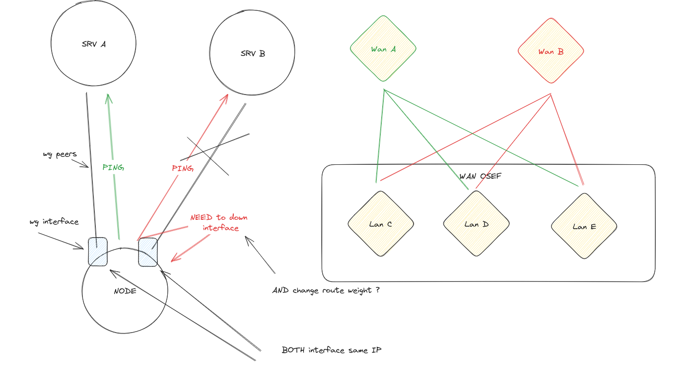

# WireGuard VPN Failover

## Overview

The wg vpn failover script ensures uninterrupted WireGuard VPN connectivity by dynamically switching to backup peers when the main ones become unreachable. Priority-based route modifications facilitate seamless failover without altering the main network, making it ideal for scenarios like Kubernetes.



## Quick Start

1. **Run Docker Compose:**

    ```bash
    docker-compose up -d
    ```

2. **Ping a Client:**

    ```bash
    docker exec wg-cli-a ping 10.0.0.2
    ```

3. **Test Failover:**

    - Observe uninterrupted connectivity by stopping the primary WireGuard server:
    
        ```bash
        docker stop wg-srv-a
        ```

    - Confirm no packet loss during failover.

## Project Components

### 1. Failover Script

The failover script dynamically monitors peer availability and activates backup interfaces using route priority. This ensures a rapid response to primary interface failures.

### 2. Dockerized WireGuard Server

The project includes a Docker Compose configuration for easy deployment and testing. The servers can be started and stopped with simple commands.